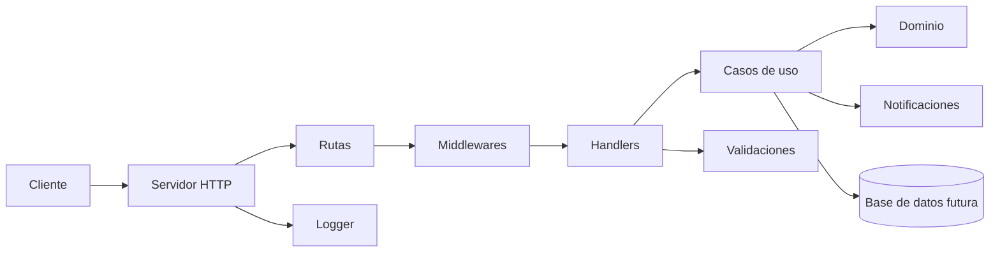
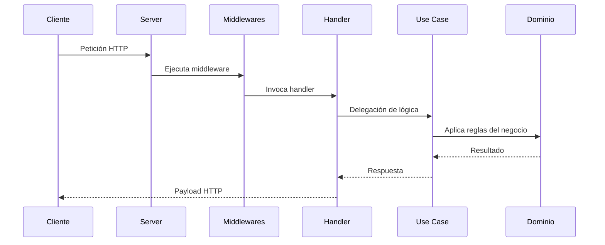

# Devboard — Visión de alto nivel

## Descripción

Devboard es un backend en Go pensado para gestionar tareas y flujos de trabajo de un tablero colaborativo. La aplicación sigue una estructura modular orientada a separar dominio, servidor, handlers, validaciones y soporte transversal.

El proyecto se encuentra en una etapa inicial, pero su base está diseñada para crecer sin mezclar responsabilidades entre capas.

## Objetivo

Proporcionar una API REST con una estructura limpia para:

- gestionar tareas
- manejar estados de trabajo
- mantener validaciones del dominio
- incorporar futuras funcionalidades como persistencia, usuarios y notificaciones

## Arquitectura

### Capas principales

- Entrada HTTP: servidor y enrutado
- Handlers: reciben y responden peticiones
- Casos de uso: coordinación de la lógica
- Dominio: entidades, reglas y estados
- Utilidades: logger, validación y extensiones futuras

## Secuencia general

## Validaciones relevantes

El dominio ya incluye una validación clara para los estados de tarea:

- todo
- in_progress
- done

La validación se realiza en el tipo TaskStatus y evita aceptar valores fuera del flujo definido del negocio.

## Notas de diseño

- El proyecto mantiene una separación entre dominio e infraestructura.
- Los middlewares centralizan logging y manejo de errores.
- La API está preparada para evolucionar hacia CRUD real, persistencia y más casos de uso.
- La documentación Swagger y la estructura modular respaldan una base clara para crecer.

## Resumen

Devboard tiene una base tecnológica limpia y una arquitectura pensada para escalar. Actualmente cubre la capa fundamental de servidor, middleware y validación del dominio, y está listo para seguir incorporando más funcionalidades de negocio.
